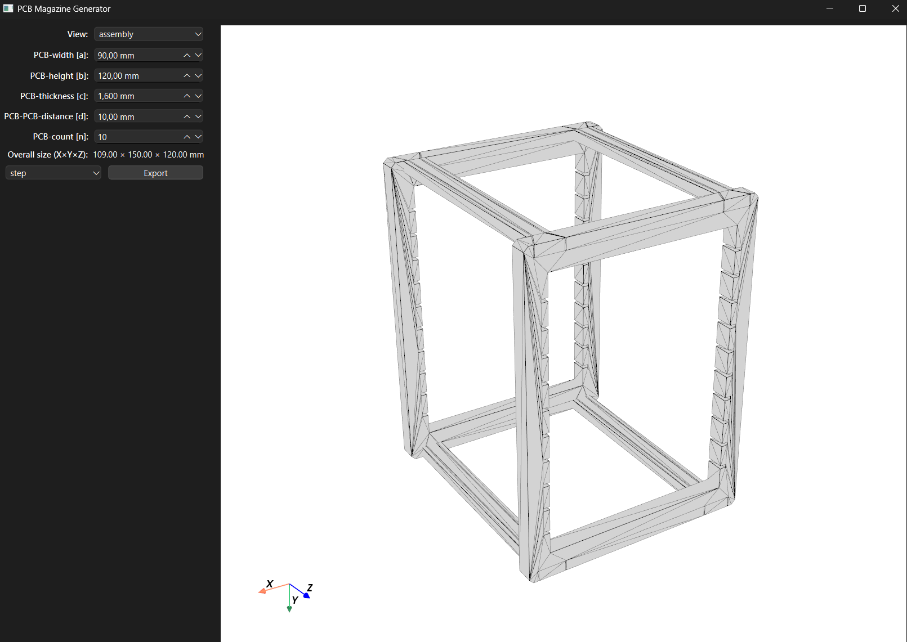
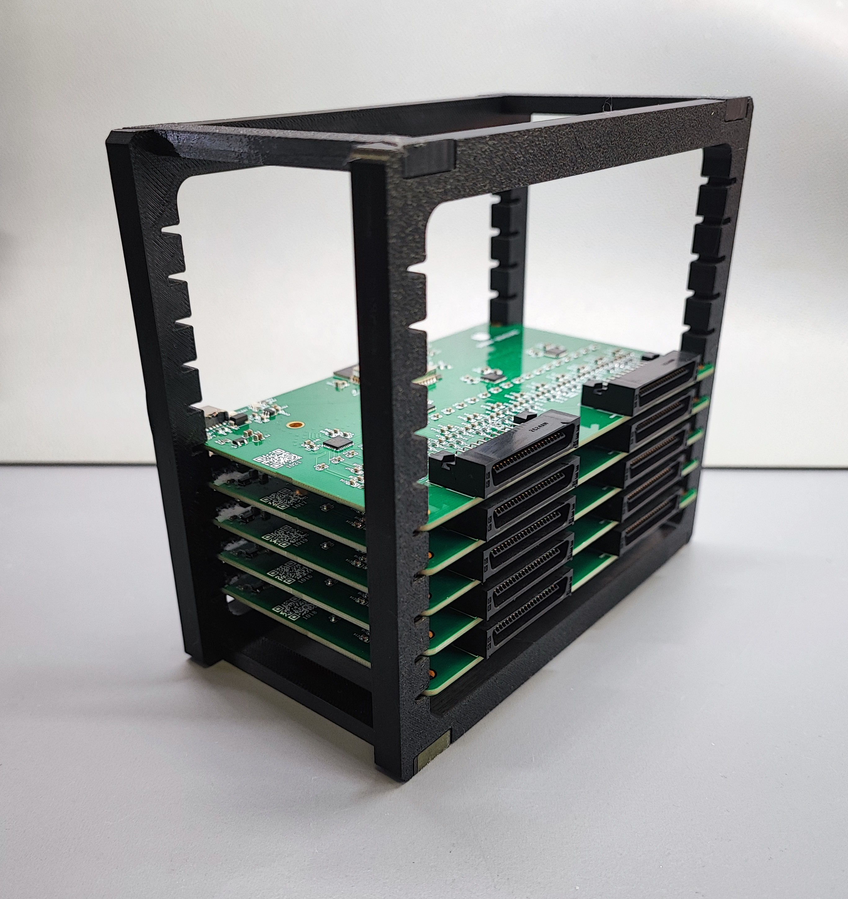

# PCB Magazine Generator

The **PCB Magazine Generator** is a parametric tool for designing and exporting modular PCB magazines, for 3D printing or CNC manufacturing.

It provides both a **GUI** and **CLI** to quickly adjust PCB dimensions, spacing, and connector properties, and export the resulting 3D models to **STL** or **STEP**.

---

## Features

- **Three build modes:**
  - `frame` – single magazine side frame
  - `bone` – single dovetail connector
  - `assembly` – full assembly with 2 frames and 4 connectors
- **Live 3D preview** using VTK/PyVista
- **Parametric controls** for:
  - PCB width (`a`)
  - PCB height (`b`)
  - PCB thickness (`c`)
  - PCB-to-PCB distance (`d`)
  - Number of PCBs (`n`)
- **Export** to STL or STEP
- **Tooltips** for all parameters
- Automatic preview refresh after parameter changes

---

## Installation

```bash
# Clone the repository
git clone https://github.com/yourusername/pcb-magazine-generator.git
cd pcb-magazine-generator

# Create and activate a virtual environment (optional but recommended)
python -m venv .venv
source .venv/bin/activate   # Linux/Mac
.venv\Scripts\activate    # Windows

# Install dependencies
pip install -r requirements.txt
```

---

## Usage

### GUI Mode (default)
```bash
python app.py
```


### CLI Mode
```bash
python app.py --nogui --component assembly -a 90 -b 120 -c 1.6 -d 10 -n 10 --fmt stl --out model.stl
```

**Arguments:**
- `--component` : `frame`, `bone`, or `assembly`
- `-a` : PCB width [mm] (inner X dimension)
- `-b` : PCB height [mm] (bone tip-to-tip length)
- `-c` : PCB thickness [mm] (slot width)
- `-d` : PCB-to-PCB distance [mm] (material between slots)
- `-n` : PCB count (number of slots)
- `--fmt` : Output format (`stl` or `step`)
- `--out` : Output file path

---

## Dependencies

- Python 3.9+
- [CadQuery](https://cadquery.readthedocs.io/)
- [PyVista](https://docs.pyvista.org/)
- [PyVistaQt](https://qtdocs.pyvista.org/)
- PyQt6

Install all with:
```bash
pip install cadquery pyvista pyvistaqt PyQt6
```

---

## File Structure

```
app.py                  # Main entry point (GUI + CLI)
docs/                   # preview pictures 
  ...
ui/
  main_window.py        # Main GUI window
  viewer.py             # VTK/PyVista 3D viewer
models/
  frame_model.py        # Generates frame geometry
  bone_model.py         # Generates bone geometry
  assembly.py           # Combines frames and bones into an assembly
exporter/
  exporter.py           # Exports models to STL/STEP
```

---

## Examples
The assembly is simple: the bones can be easily pressed into the sides.



## License

This project is licensed under the MIT License.
